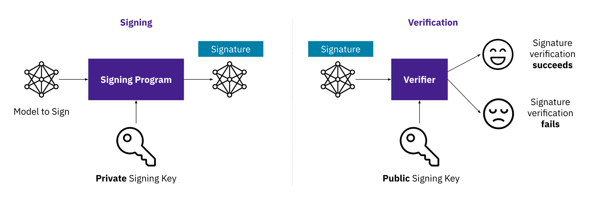
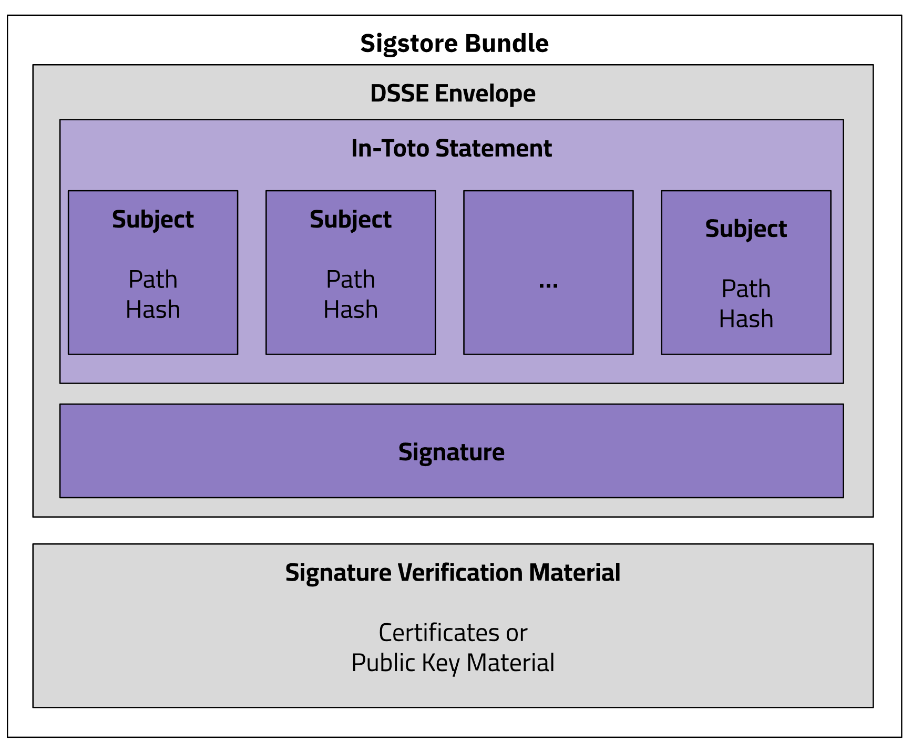

# **OpenSSF Model Signing (OMS) Specification**

This repository contains the specification, documentation and test cases for the OpenSSF Model Signing (OMS) format.

## **Introducing OMS**

### Motivation

As AI adoption continues to accelerate, so does the need to secure the AI supply chain. Organizations want to be able to verify that the models they build, deploy, or consume are authentic, untampered, and compliant with internal policies and external regulations. From tampered models to poisoned datasets, the risks facing production AI systems are growing — and the industry is responding.

### The OMS Specification

In collaboration with industry partners, the Open Source Security Foundation (OpenSSF)’s AI/ML Working Group has introduced OpenSSF Model Signing (OMS): a flexible and implementation-agnostic standard and tooling for model signing, purpose-built for the unique requirements of AI workflows.

The OMS specification defines a detached signature file that is typically distributed within the model folder. OMS is PKI-agnostic and supports signing with bare keys, PKI certificate chains, or identity-based keyless signing with Sigstore.

### Objective and Scope

This repository defines the OMS specification. It also includes test cases: a corpus of signed OMS files for verifier programs to check if they are verifying correctly.

This repository does not contain any signing or verification programs. Since OMS version 1, they are implemented independently of the specification. (For example, see https://github.com/sigstore/model-transparency.)

## **What is Model Signing?**

Model signing uses cryptographic keys to ensure the integrity and authenticity of an AI model. A signing program uses a private key to generate a digital signature for the model. Anyone can then verify this signature using the corresponding public key. If verification succeeds, the model is confirmed as untampered and authentic; if it fails, the model may have been altered or is untrusted.

#### Model signing can be used to

* Verify the integrity of ML models and datasets, ensuring they have not been tampered with.
* Authenticate the origin of the artifacts, providing traceability to their creators.
* Embed critical metadata about the model's development.
* Create a verifiable chain of custody for model artifacts throughout their lifecycle.
* Provide a standardized method to assert claims about model characteristics.

#### What does model signing enable?

Model signing creates a tamper-evident seal that enables downstream consumers to verify:
1. **Integrity**: The model files have not been modified since signing.
2. **Authenticity**: The model was created by the claimed organization or individual.
3. **Provenance**: The complete lineage of the model
4. **Compliance**: Adherence to regulatory and organizational requirements through verifiable metadata.
5. **Accountability**: Clear attribution of responsibility for model development and distribution.

By signing model artifacts, organizations can establish trust and accountability throughout the ML supply chain, from initial development to deployment and beyond. This becomes increasingly critical as models are shared, modified, and incorporated into various applications across organizational boundaries.

#### What Model Signing is NOT

Model signing is not:
* A replacement for secure model development practices: Signing only verifies that a model hasn't changed since being signed; it cannot address vulnerabilities or insecure practices introduced during development. Teams must still implement secure coding practices, conduct vulnerability scanning, and perform security testing throughout the model development lifecycle.
* A guarantee of model quality, fairness, or ethical behavior: A cryptographic signature attests to authenticity and integrity, not to the inherent quality or ethical characteristics of a model. A perfectly signed model may still produce biased results, make inaccurate predictions, or behave unethically if trained on problematic data or with flawed objectives.
* A solution for model privacy or confidentiality: Signing focuses on verifying authenticity and integrity, not on protecting the confidentiality of model weights, architecture, or intellectual property. Additional encryption and access control mechanisms are required to maintain model privacy.
* A comprehensive security solution on its own: Model signing addresses specific supply chain security concerns but must be part of a broader security strategy including secure deployment, runtime monitoring, access controls, and vulnerability management to provide comprehensive protection.
* A mechanism to prevent all forms of model misuse: While signing can help establish accountability, it cannot prevent authorized users from employing models in ways that violate guidelines or ethics. Additional governance frameworks and usage policies are necessary to address misuse concerns.
* A substitute for proper access controls: Signatures verify authenticity but do not restrict who can access or use models. Organizations must implement appropriate authentication and authorization systems to control who can deploy or interact with ML models.

#### Why Should You Use Model Signing?

Model signing is critical for:

* **Supply Chain Security**: Mitigates risks like model tampering, poisoned datasets, and unauthorized modifications.
* **Compliance**: Ensures adherence to regulatory requirements by embedding verifiable metadata.
* **Provenance**: Tracks the origins and development of ML artifacts, aiding in reproducibility and trust.
* **Incident Response**: Provides a mechanism to trace and remediate compromised models or datasets.

## **OMS Specification**

### OMS Signature Format

OMS is designed to handle the complexity of modern AI systems, supporting any type of model format and models of any size. Instead of treating each file independently, OMS uses a detached OMS Signature Format that can represent multiple related artifacts—such as model weights, configuration files, tokenizers, and datasets—in a single, verifiable unit.

The OMS Signature Format includes:
* A list of all files in the bundle, each referenced by its cryptographic hash (e.g., SHA256)
* An optional annotations section for custom, domain-specific fields (future support coming)
* A digital signature that covers the entire manifest, ensuring tamper-evidence.

The OMS Signature File follows the Sigstore Bundle Format, ensuring maximum compatibility with existing Sigstore (a graduated OpenSSF project) ecosystem tooling.  This detached format allows verification without modifying or repackaging the original content, making it easier to integrate into existing workflows and distribution systems.

### File Format

The OMS files are detached Sigstore bundles containing:

* DSSE Envelope
   * In-Toto Statements
      * Manifest: Describes all files in the bundle with their cryptographic hashes.
      * Embedded Metadata: Optional additional predicates with information like model version, training data sources, and hardware used.
   * Signature: Cryptographically signs the in-toto statement for tamper-proofing.
* Signature Verification Material
   * Includes information needed to verify the signature, such as certificate chains

### PKI Support

The model signing approach is PKI-agnostic and supports the following methods:
* Bare Key: Uses raw cryptographic keys without a certificate chain.
* Self-Signed Certificate: Signs artifacts with a self-generated certificate.
* Private Key Infrastructure Providers: Uses a trusted certificate authority (CA) for signing.
* Sigstore: Leverages public or private Sigstore services for signing and verification.

### Hashing Functions

**SHA-256** (default): A cryptographic hash function from the SHA-2 family that produces a 256-bit (32-byte) hash value. This is the default hashing algorithm used in the project.

**BLAKE2b**: An alternate high-performance cryptographic hash function that's faster than SHA-3 and as secure as SHA-256. BLAKE2 offers excellent performance on modern processors, making it particularly well-suited for hashing large ML models while maintaining strong security guarantees. The BLAKE2b variant is optimized for 64-bit platforms.

## **Get Involved**

### Meetings

Work on OMS is done under the guidance of the OpenSSF AI/ML Security Working Group: 
https://github.com/ossf/ai-ml-security

### Intellectual Property

In accordance with the [OpenSSF Charter (PDF)](https://charter.openssf.org/), work produced by this group is licensed as follows:

1. Software source code
* Apache License, Version 2.0, available at https://www.apache.org/licenses/LICENSE-2.0;
2. Data
* Any of the Community Data License Agreements, available at https://www.cdla.io;
3. Specifications
* Community Specification License, Version 1.0, available at https://github.com/CommunitySpecification/1.0
4. All other Documentation
* Creative Commons Attribution 4.0 International License, available at https://creativecommons.org/licenses/by/4.0/

### Antitrust Policy Notice

Linux Foundation meetings involve participation by industry competitors, and it is the intention of the Linux Foundation to conduct all of its activities in accordance with applicable antitrust and competition laws. It is therefore extremely important that attendees adhere to meeting agendas, and be aware of, and not participate in, any activities that are prohibited under applicable US state, federal or foreign antitrust and competition laws.

Examples of types of actions that are prohibited at Linux Foundation meetings and in connection with Linux Foundation activities are described in the Linux Foundation Antitrust Policy available at http://www.linuxfoundation.org/antitrust-policy. If you have questions about these matters, please contact your company counsel, or if you are a member of the Linux Foundation, feel free to contact Andrew Updegrove of the firm of Gesmer Updegrove LLP, which provides legal counsel to the Linux Foundation.